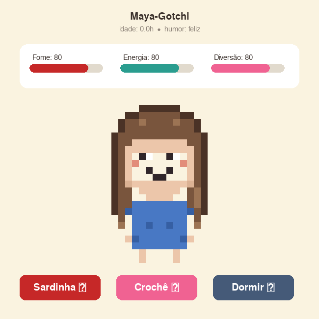
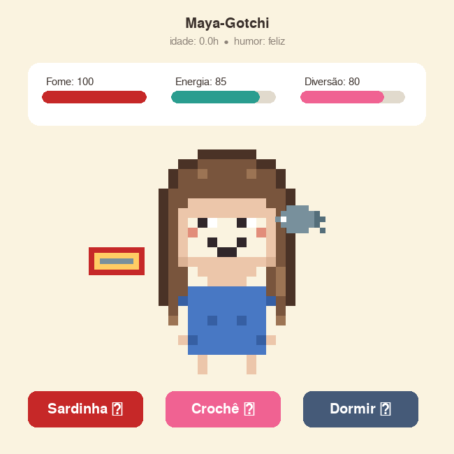
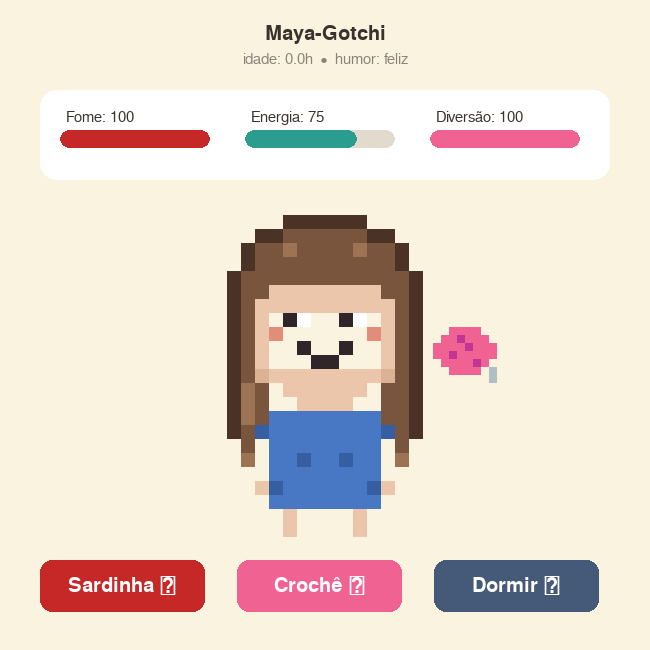
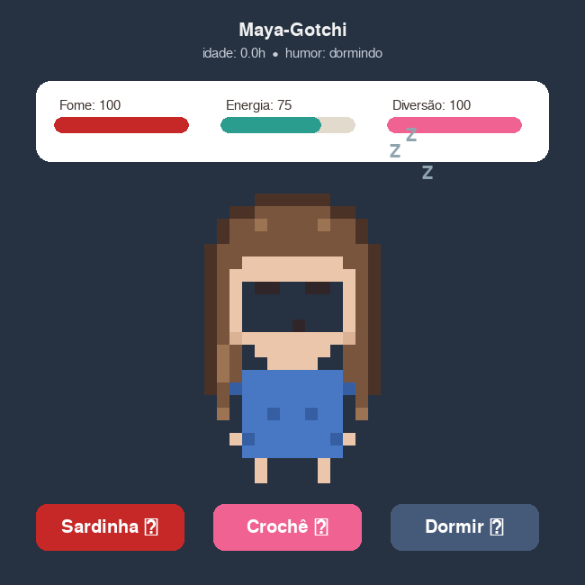

# Maya-Gotchi


> Um tamagotchi em Python/Pygame com personalidade própria: se alimenta de **sardinhas em conserva** e relaxa **fazendo crochê**.

Bichinho virtual inspirado nos Tamagotchis dos anos 90, construído do zero — sem engine e sem assets externos. Toda a arte é **pixel art procedural**: os sprites são grades de caracteres definidas no próprio código e convertidas em imagem em tempo de execução.

## Screenshots

| Idle | Comendo sardinha |
|:---:|:---:|
|  |  |

| Fazendo crochê | Dormindo |
|:---:|:---:|
|  |  |

## Como funciona

A personagem tem **três atributos** (0–100) que decaem em tempo real:

| Atributo | Decaimento | Como recuperar |
|---|---|---|
| Fome | 3 pts/min | Comer sardinha (+30) |
| Energia | 1,5 pts/min | Dormir (+8 pts/s durante o sono) |
| Diversão | 2 pts/min | Fazer crochê (+30, mas gasta 10 de energia) |

A **média dos três atributos define o humor**, refletido na expressão facial: acima de 65 ela fica feliz (sorriso e bochechas rosadas), acima de 35 fica neutra, e abaixo disso triste. Se estiver exausta (energia ≤ 15), ela **recusa** a sessão de crochê.

E o detalhe favorito do projeto: **o pet continua "vivendo" com o jogo fechado**. O estado é salvo automaticamente em `save.json` a cada 10 segundos e, ao reabrir, o tempo offline é simulado — se você passar o dia fora, ela vai estar com fome (com um teto de 8h de decaimento, para ninguém voltar de viagem e encontrar uma tragédia).

##  Instalação e execução

**Pré-requisito:** Python 3.10+ ([python.org](https://www.python.org/downloads/))

> ⚠️ Este é um **aplicativo desktop** — roda no seu computador, não em notebooks como Google Colab ou Jupyter (o Pygame abre uma janela gráfica interativa em tempo real, e servidores de notebook não têm tela).

```bash
# 1. Clonar o repositório
git clone https://github.com/SEU-USUARIO/maya-gotchi.git
cd maya-gotchi

# 2. (Opcional, mas boa prática) criar um ambiente virtual
python3 -m venv .venv
source .venv/bin/activate        # Linux/Mac
.venv\Scripts\activate           # Windows

# 3. Instalar as dependências
pip install -r requirements.txt

# 4. Rodar o jogo
python3 maya_gotchi.py           # Linux/Mac
python maya_gotchi.py            # Windows
```

**Dependências:** apenas o `pygame` precisa ser instalado — os demais imports (`json`, `math`, `os`, `time`) fazem parte da biblioteca padrão do Python.

## Controles

Três botões, tudo com o mouse:

- **Sardinha ** — alimenta (+30 fome, +5 energia); uma latinha e um peixinho animado aparecem na tela
- **Crochê ** — sessão de crochê com novelo balançando (+30 diversão, −10 energia)
- **Dormir ** — o cenário escurece, "Zzz" flutuam e a energia recarrega

Para fechar, use o  da janela — o jogo salva o estado antes de sair.

## Arquitetura

O código separa três responsabilidades: **dados/arte** (paleta e sprites), **regras do jogo** (modelo, sem nenhuma dependência de interface) e **interface** (janela, botões e game loop) — uma versão simplificada do padrão MVC. A classe `Pet` não conhece o Pygame, o que a torna testável isoladamente.

```
maya_gotchi.py
├── PALETA / COR_BLUSA        # cores e configuração
├── grade_para_surface()      # converte grade de caracteres em pixel art
├── sprite_maya()             # gera o avatar por expressão e frame de animação
├── Stat                      # atributo 0-100 com decaimento por tempo
├── Pet                       # estado, regras, ações e serialização
├── salvar() / carregar()     # persistência JSON + decaimento offline
├── Button                    # botão clicável genérico (recebe callback)
└── Game                      # janela, game loop, render e eventos
```

### Conceitos demonstrados

| Conceito | Onde no código |
|---|---|
| POO e separação de responsabilidades | `Stat`, `Pet`, `Button`, `Game` |
| Game loop com delta time | `Game.executar()` — a lógica roda em tempo real, independente do FPS |
| Máquina de estados | `Pet.estado`: idle / eating / crocheting / sleeping |
| Serialização e persistência | `Pet.to_dict()` / `Pet.from_dict()` + JSON |
| Simulação de tempo offline | decaimento aplicado ao carregar o save |
| Callbacks / funções de primeira classe | `Button(..., self.pet.alimentar)` |
| Renderização procedural | `grade_para_surface()` — sprites como dados, não imagens |
| Animação com trigonometria | respiração, mordidas e balanço via `math.sin()` |
| Tratamento de erros específico | `ImportError`, `NameError` e JSON corrompido |

## Customização

O avatar é definido como **grades de caracteres** onde cada letra é uma cor da `PALETA` — editar o visual é literalmente editar strings:

```python
"PCS.OB..OB.SCP"   # P=contorno do cabelo, C=cabelo, S=pele, O=olho, B=brilho
```

- **Trocar a cor da blusa:** mude `COR_BLUSA = "azul"` para `"amarela"` no topo do arquivo
- **Mudar o penteado ou as expressões:** edite as grades em `sprite_maya()`
- **Nova paleta de cores:** altere os valores RGB no dicionário `PALETA`
- **Balancear a dificuldade:** ajuste `decaimento_por_min` de cada `Stat` no `Pet.__init__`
- **Tamanho da janela e velocidade:** constantes `LARGURA`, `ALTURA`, `FPS` e `PIXEL` no topo

## 🗺️ Roadmap

- [ ] Mini-game de crochê (sequência de teclas = pontos corretos da carreira)
- [ ] Estatísticas históricas com matplotlib (sardinhas consumidas por dia 📊)
- [ ] Roupas e acessórios desbloqueáveis
- [ ] Sons (mastigação, agulhada, ronco)
- [ ] Versão web com [Pygbag](https://pypi.org/project/pygbag/) — Pygame compilado para WebAssembly, jogável no navegador

##  Sobre
Projeto de portfólio desenvolvido como exercício de POO, game loops e renderização procedural em Python, com um toque pessoal: as sardinhas e o crochê não são aleatórios. 


## 📄 Licença

Distribuído sob a licença MIT. Veja o arquivo [LICENSE](LICENSE) para detalhes.
